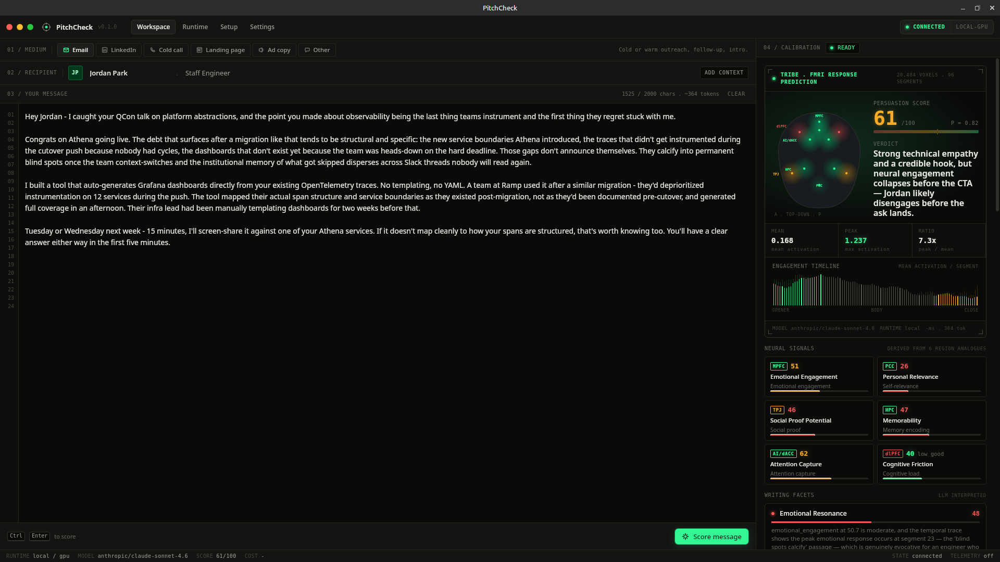

<div align="center">

<br>

# PitchCheck

**Know if your pitch will land before you send it.**

Score sales emails, cold outreach, LinkedIn DMs, and call scripts against a neuroscience model that predicts how the reader's brain will actually respond.

<br>

[](https://github.com/aytzey/PitchCheck/releases)

<br>

[](https://github.com/aytzey/PitchCheck/actions/workflows/ci.yml)
[](https://github.com/aytzey/PitchCheck/releases)
[](LICENSE)


[Download](https://github.com/aytzey/PitchCheck/releases) · [Quick Start](#quick-start) · [How the Scoring Works](#how-the-scoring-works) · [Architecture](#architecture)

</div>

---

## What This Does

You paste a message, set a recipient ("Jordan Park, Staff Engineer"), pick a channel (email, LinkedIn, cold call, landing page, ad copy), and hit score.

PitchCheck runs your text through Meta's [TRIBE v2](https://github.com/facebookresearch/tribev2) brain encoding model — the same model used in computational neuroscience research to predict fMRI responses to naturalistic stimuli. It maps your message onto ~20,000 cortical vertices and treats the output as **predicted neural-response analogues**, not measured fMRI from the recipient. It returns:

- **Persuasion score** (0–100) with calibration confidence
- **Six neural signals** — affective value salience, early attention salience, self-value relevance, social cognition/sharing, encoding potential, cognitive friction
- **Neuro-persuasive axes** — self/value fit, reward/affect, social cognition, encoding/attention, processing fluency
- **Segment-by-segment engagement timeline** — where the reader tunes in, where they drop off
- **Verdict and narrative** — an LLM reads the neural output and explains what's working and what isn't
- **Rewrite suggestions** — before/after alternatives with reasoning

The whole loop takes a few seconds. Write, score, tweak, re-score.

## How the Scoring Works

The pipeline has three stages. All of this runs locally if you have a GPU; otherwise PitchCheck rents one on [Vast.ai](https://vast.ai) and tears it down when you disconnect.

### 1. Text → TRIBE Prediction

Your message gets tokenized into word-level events with synthetic timing (0.32s/word, 0.40s gap). TRIBE v2 takes those events and produces a prediction matrix of shape `(n_segments, 20484)` — each row is a time segment, each column is a cortical vertex on the fsaverage5 mesh.

No audio synthesis, no image generation — the `direct` text input mode skips gTTS/WhisperX entirely and works straight from the text.

### 2. Prediction → Neural Features → Persuasion Signals

Ten raw features get extracted from the prediction matrix:

| Feature | What it captures |
|---------|-----------------|
| `global_mean_abs` | Overall predicted-response intensity |
| `global_peak_abs` | Maximum predicted voxel response |
| `temporal_std` | How much predicted response varies across segments |
| `early_mean` | First-quartile predicted response (opener strength) |
| `late_mean` | Last-quartile predicted response (close strength) |
| `max_temporal_delta` | Largest consecutive segment shift |
| `spatial_spread` | Fraction of voxels above global mean |
| `focus_ratio` | Top-10% voxel mean vs. global mean |
| `sustain_ratio` | Fraction of segments above mean |
| `arc_ratio` | (max − min) / mean of temporal trace |

These get ratio-normalized against `global_mean_abs` and mapped through calibrated band ranges into six predicted-response signals (0–100):

| Signal | Conservative analogue | Key inputs |
|--------|----------------------|------------|
| Affective Value Salience | mPFC/value and affective salience | peak intensity, temporal variation, arc, delta |
| Early Attention Salience | Salience network (AI/dACC) | early predicted response, peak, spatial spread |
| Self-Value Relevance | mPFC/vmPFC/PCC self/value processing | sustain, focus, late predicted response |
| Social Cognition / Sharing | TPJ/dmPFC/default-network social cognition | peaks, temporal dynamics, spread |
| Encoding Potential | Hippocampal/temporal memory encoding | arc, sustain, peak, focus |
| Cognitive Friction | dlPFC/control-load analogue | inverse of sustain, focus, spread |

Scores are compressed to [8, 92] to avoid false confidence at extremes. Cognitive friction is inverted — a high number means high friction, which is bad. A prediction-quality gate then shrinks the final score toward neutral when the TRIBE output is near-zero, flat, too short, or too low-resolution to support a strong claim.

The final score is calibrated from these signals through five TRIBE-derived neuro-persuasive axes:

| Axis | What it means |
|------|---------------|
| Self-value fit | mPFC/vmPFC/PCC self- and value-processing analogue |
| Reward/affect motivation | Ventral-striatum/OFC/affective valuation analogue |
| Social cognition/sharing | TPJ/dmPFC/default-network social cognition analogue |
| Encoding and attention | Memory/attention/salience analogue |
| Processing fluency | Inverse cognitive-control/friction analogue |

### 3. Neural Output → LLM Interpretation

The raw signals and prediction summary go to an LLM (Claude Sonnet via [OpenRouter](https://openrouter.ai)) along with the recipient persona and channel context. The LLM produces the verdict, narrative, strength/risk analysis, and rewrite suggestions.

PitchCheck no longer uses deterministic keyword/regex persuasion heuristics for scoring. The final score is determined by TRIBE-predicted fMRI response geometry; the pitch text and persona are given to the LLM only as untrusted semantic context for interpretation and rewrite advice. Any LLM score is retained only as audit metadata and clamped to the neural band before display.

Repeated TRIBE predictions are cached in-process, but OpenRouter prompt/output caps and fast-model routing are intentionally disabled; quality is preferred over latency/cost.

The neuroscience layer follows a conservative triangulation rule from consumer-neuroscience and neuroforecasting work: TRIBE output is useful evidence, but it is not treated as recipient-level measured fMRI. Region labels are interpretive anchors, reverse-inference risk is exposed through confidence reasons and scientific caveats, and weak prediction matrices lower both confidence and score extremity.

Research basis for the calibration layer includes Falk et al. on neural responses predicting persuasion-induced behavior change ([2010](https://pmc.ncbi.nlm.nih.gov/articles/PMC3027351/)), neural focus groups predicting population-level media effects ([2012](https://pmc.ncbi.nlm.nih.gov/articles/PMC3725133/)), and MPFC/self-value signals predicting health behavior change and campaign response ([2011](https://doi.org/10.1037/a0022259), [2016](https://doi.org/10.1093/scan/nsv108)); Venkatraman et al. on fMRI predicting market-level advertising response ([2015](https://doi.org/10.1509/jmr.13.0593)); Scholz et al. on value/self/social signals and information sharing ([2017](https://doi.org/10.1177/0956797617695073)); Chan, Scholz et al. on cross-cultural neural prediction of information sharing ([2023](https://doi.org/10.1073/pnas.2313175120)); Chan et al. on temporal neural signals of ad liking ([2024](https://doi.org/10.1177/00222437231194319)); Cohen et al. on reward vs. mentalizing predictors of persuasiveness by narrative type ([2024](https://doi.org/10.1038/s41598-024-62341-3)); Scholz, Chan & Falk et al. on a 16-study message-effectiveness mega-analysis ([2025](https://doi.org/10.1093/pnasnexus/pgaf287)); Cao & Reimann on triangulation and reverse-inference limits ([2020](https://doi.org/10.3389/fpsyg.2020.550204)); and TRIBE v2 as an in-silico fMRI foundation model ([GitHub](https://github.com/facebookresearch/tribev2), [Hugging Face](https://huggingface.co/facebook/tribev2)).

This layer is optional — scoring works without an OpenRouter key, you just won't get the written interpretation.

## Quick Start

### Desktop App

Grab the installer from [Releases](https://github.com/aytzey/PitchCheck/releases) — Linux (.deb, .rpm), macOS (universal .dmg), Windows (.msi).

The app auto-detects your GPU situation:
- **NVIDIA GPU available** → runs the TRIBE service locally via Docker on `127.0.0.1:8090`
- **No GPU** → enter a Vast.ai API key, PitchCheck finds the cheapest matching instance, deploys, scores, and destroys on disconnect

API keys stay in memory. Nothing hits disk.

### From Source

```bash
git clone https://github.com/aytzey/PitchCheck.git
cd PitchCheck
npm install
npm run desktop:dev
```

On Ubuntu/Debian, you'll need Tauri's system deps first:

```bash
sudo apt-get install -y libgtk-3-dev libwebkit2gtk-4.1-dev \
  libayatana-appindicator3-dev librsvg2-dev
```

### Docker Compose (Web Only)

```bash
cp .env.example .env
docker compose up -d --build
```

App runs on `http://localhost:3000`.

### Mobile App (Expo, iOS-first, TestFlight-ready)

PitchCheck includes a production-oriented Expo mobile client in `mobile/` with the same dark design language as desktop and native runtime controls:

- **PitchServer** runtime
- **Vast AI** runtime
- Transport mode toggle (`auto`, `next-api`, `direct`)
- Runtime health probing before scoring
- Secure local credential storage (`expo-secure-store`)
- EAS build profiles for development/preview/production and iOS submit scripts

Run it:

```bash
npm run mobile:install
npm run mobile:start
```

For App Store release flow, see `mobile/README.md` (`build:ios`, `submit:ios`) and configure `mobile/.env` from `.env.example`.

### One-Line Install

```bash
npm run install:local
```

Handles everything — git pull, env setup, npm install, lint, test, build, TRIBE Docker image, desktop bundle, system package install.

## Architecture

```
┌─────────────────────────────────────────────────────┐
│                    Tauri 2 Shell                     │
│          (Rust · signed installers · auto-update)    │
│                                                     │
│  ┌───────────────────────────────────────────────┐  │
│  │              Next.js 16 + React 19            │  │
│  │          (Tailwind v4 · Lucide icons)         │  │
│  └────────────────────┬──────────────────────────┘  │
│                       │                             │
│           ┌───────────┴───────────┐                 │
│           │   Rust Runtime Mgr    │                 │
│           │  (Docker / Vast.ai)   │                 │
│           └───────────┬───────────┘                 │
└───────────────────────┼─────────────────────────────┘
                        │
            ┌───────────┴───────────┐
            │  FastAPI TRIBE Svc    │
            │  facebook/tribev2     │
            │  ~20K cortical verts  │
            ├───────────────────────┤
            │  OpenRouter LLM       │
            │  (interpretation)     │
            └───────────────────────┘
                    runs on
           ┌────────┴────────┐
      Local NVIDIA      Vast.ai
        Docker GPU      Cloud GPU
```

The Rust layer in Tauri manages the entire GPU lifecycle — detecting `nvidia-smi`, pulling the Docker image, starting/stopping containers, or provisioning Vast.ai instances with the cheapest verified offer within configured price/VRAM limits.

## API

### `POST /api/score`

```json
{
  "message": "Hey Jordan — caught your QCon talk on observability...",
  "persona": "Staff Engineer, infrastructure background",
  "platform": "email"
}
```

Returns persuasion score, neural signals, engagement timeline, verdict, strengths, risks, and rewrite suggestions.

### `GET /api/health`

Service readiness check.

## Development

```bash
npm run dev              # Next.js dev server
npm run desktop:dev      # Tauri desktop dev
npm run lint             # ESLint
npm test                 # Vitest
npm run build            # Production web build
npm run desktop:build    # Native installers
```

TRIBE service standalone (mock mode for development):

```bash
cd tribe_service
python3 -m venv .venv && source .venv/bin/activate
pip install -r requirements.txt
TRIBE_ALLOW_MOCK=1 uvicorn tribe_service.app:app --host 0.0.0.0 --port 8090
```

Desktop Rust checks:

```bash
npm run build:desktop-web
npm run desktop:check
cargo test --manifest-path src-tauri/Cargo.toml
```

## Configuration

| Variable | Default | What it does |
|----------|---------|--------------|
| `OPENROUTER_API_KEY` | — | Turns on LLM verdicts and rewrites |
| `OPENROUTER_MODEL` | `anthropic/claude-sonnet-4.6` | High-quality model for interpreting neural output |
| `OPENROUTER_REFINER_MODEL` | `OPENROUTER_MODEL` | Which model generates LLM rewrite drafts in the desktop app and `/refine` service endpoint |
| `OPENROUTER_TIMEOUT_SECONDS` | `60` | LLM request timeout; prompt/output caps are not applied |
| `TRIBE_DEVICE` | `cuda` | `cuda`, `cpu`, or `auto` |
| `TRIBE_TEXT_DEVICE` | `auto` | Device for the 3B text feature model |
| `TRIBE_ALLOW_MOCK` | `0` | Deterministic mock for tests |
| `TRIBE_PREDICTION_CACHE_SIZE` | `8` | In-memory LRU cache for repeated TRIBE text predictions |
| `TRIBE_SCORE_TIMEOUT_SECONDS` | `900` | Timeout (first run downloads ~8GB of weights) |

<details>
<summary>Full variable list</summary>

| Variable | Default | Description |
|----------|---------|-------------|
| `TRIBE_MODEL_ID` | `facebook/tribev2` | Model identifier |
| `TRIBE_TEXT_BATCH_SIZE` | `auto` | Batch 1 on sub-10GB GPUs |
| `TRIBE_TEXT_INPUT_MODE` | `direct` | `direct` skips TTS/WhisperX |
| `TRIBE_MAX_SCORE_CONCURRENCY` | `1` | Keep at 1 on local GPUs |
| `TRIBE_OOM_FALLBACK_TEXT_DEVICE` | `accelerate,cpu` | Comma-separated retry devices after CUDA OOM |
| `TRIBE_ACCELERATE_MAX_GPU_MEMORY_GB` | `auto` | GPU memory cap for Accelerate offload |
| `TRIBE_ACCELERATE_MAX_CPU_MEMORY_GB` | `32` | CPU RAM cap for Accelerate offload |
| `TRIBE_ACCELERATE_OFFLOAD_FOLDER` | `/models/offload` | Disk folder for Accelerate offloaded weights |
| `TRIBE_SERVICE_URL` | `http://tribe-service:8090` | Backend URL for frontend |
| `PITCHCHECK_TRIBE_IMAGE` | `ghcr.io/aytzey/pitchcheck-tribe:latest` | Runtime image override |

</details>

## CI/CD

Three GitHub Actions workflows:

- **ci.yml** — lint, test, build (web + desktop Rust checks + Compose validation) on every push/PR
- **tribe-image.yml** — builds and pushes `ghcr.io/<owner>/pitchcheck-tribe:latest` when `tribe_service/` changes on main
- **desktop-installers.yml** — cross-platform release builds (Linux/macOS/Windows) on `v*` tags, with Tauri updater signing

## Tech Stack

| Layer | Tech |
|-------|------|
| Desktop shell | [Tauri 2](https://tauri.app) (Rust) |
| Frontend | [Next.js 16](https://nextjs.org), React 19, Tailwind CSS v4 |
| Scoring backend | [FastAPI](https://fastapi.tiangolo.com), Python 3.12 |
| Neural model | [TRIBE v2](https://github.com/facebookresearch/tribev2) (Meta FAIR) |
| Text features | LLaMA 3.2-3B (via TRIBE) |
| LLM interpretation | [OpenRouter](https://openrouter.ai) |
| Cloud GPU | [Vast.ai](https://vast.ai) |
| CI/CD | GitHub Actions |

## TRIBE v2 Model — License and Attribution

PitchCheck uses Meta's **TRIBE v2** (`facebook/tribev2`) for neural response prediction.

TRIBE v2 is a foundation model for in-silico neuroscience developed by Meta FAIR. It combines LLaMA 3.2-3B, V-JEPA2, and Wav2Vec-BERT to predict fMRI brain responses across ~20,000 cortical vertices on the fsaverage5 mesh. The model was trained on naturalistic fMRI datasets and is described in:

> Stéphane d'Ascoli, Jérémy Rapin, Yohann Benchetrit, Teon Brookes, Katelyn Begany, Joséphine Raugel, Hubert Banville, Jean-Rémi King. *"A foundation model of vision, audition, and language for in-silico neuroscience."* Meta FAIR, 2026.

**The TRIBE v2 model weights are licensed under [CC-BY-NC-4.0](https://creativecommons.org/licenses/by-nc/4.0/).** This means the model cannot be used for commercial purposes. PitchCheck's own source code is MIT-licensed, but any deployment that includes the TRIBE v2 weights is subject to the non-commercial restriction of CC-BY-NC-4.0.

```bibtex
@article{dAscoli2026TribeV2,
  title   = {A foundation model of vision, audition, and language
             for in-silico neuroscience},
  author  = {d'Ascoli, St{\'e}phane and Rapin, J{\'e}r{\'e}my and
             Benchetrit, Yohann and Brookes, Teon and Begany, Katelyn
             and Raugel, Jos{\'e}phine and Banville, Hubert and
             King, Jean-R{\'e}mi},
  year    = {2026}
}
```

## License

PitchCheck source code is [MIT](LICENSE).

TRIBE v2 model weights (`facebook/tribev2`) are [CC-BY-NC-4.0](https://creativecommons.org/licenses/by-nc/4.0/) — non-commercial use only. See [TRIBE v2 Model — License and Attribution](#tribe-v2-model--license-and-attribution) above.
