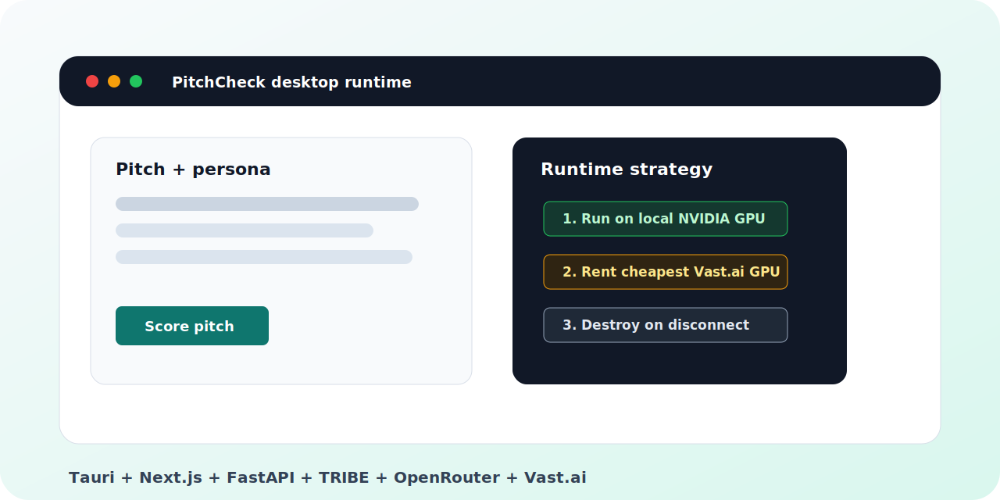

# PitchCheck

<p align="center">
  
</p>

<p align="center">
  <a href="https://github.com/aytzey/PitchCheck/actions/workflows/ci.yml"></a>
  <a href="https://github.com/aytzey/PitchCheck/actions/workflows/tribe-image.yml"></a>
  <a href="https://github.com/aytzey/PitchCheck/releases"></a>
  <a href="LICENSE"></a>
  
  
</p>

**Desktop-first neural persuasion scoring.** PitchCheck scores sales messages
with TRIBE brain-response signals, persona-aware LLM interpretation, and a
runtime manager that uses your local NVIDIA GPU first, then rents the cheapest
matching Vast.ai GPU when you need cloud compute.

## Why It Stands Out

- **Native desktop app**: Tauri shell with signed installers for Linux, macOS,
  and Windows.
- **Local GPU first**: Docker + NVIDIA runtime on `127.0.0.1:8090` when a GPU is
  available.
- **Cheapest cloud fallback**: verified Vast.ai offer search, automatic deploy,
  health wait, score routing, and destroy-on-disconnect.
- **First-run installer**: step-by-step checks for Docker, NVIDIA toolkit, image
  cache, Vast fallback, and release updates.
- **Auto-update**: signed GitHub Release updater prompt on desktop launch.
- **Real model backend**: FastAPI service around `facebook/tribev2` with
  OpenRouter interpretation.
- **Paid E2E tested**: a real Vast.ai instance was created, scored, and destroyed
  successfully on 2026-04-19.

## Product Flow

1. Enter a pitch, target persona, and channel.
2. PitchCheck scores the message with TRIBE neural-response features.
3. The LLM layer turns those signals into persuasion risks, strengths, and
   rewrites.
4. The desktop runtime keeps the expensive model service local when possible and
   disposable when cloud GPU is needed.

## Quick Start

### Desktop App

```bash
npm install
npm run desktop:dev
```

Build native Linux installers locally:

```bash
npm run desktop:build
```

On Ubuntu/Debian, install Tauri system dependencies first:

```bash
sudo apt-get install -y libgtk-3-dev libwebkit2gtk-4.1-dev libayatana-appindicator3-dev librsvg2-dev
```

Desktop runtime behavior:

- If `nvidia-smi` and Docker GPU support are available, PitchCheck starts the
  TRIBE service locally.
- If not, paste a Vast.ai API key and click **Connect**. The app picks the
  cheapest verified GPU offer within the configured price and VRAM limits.
- Click **Disconnect** to stop the local container or destroy the rented Vast.ai
  instance.

The Vast.ai key is passed in memory to Rust and is not written to project files
or saved runtime state.

### Docker Compose

```bash
cp .env.example .env
# Optional: add OPENROUTER_API_KEY for persona-aware LLM interpretation
docker compose up -d --build
```

Open `http://localhost:3000`.

### Web Development

```bash
npm install
npm run dev
```

Run the TRIBE service separately:

```bash
cd tribe_service
python3 -m venv .venv
source .venv/bin/activate
pip install -r requirements.txt
TRIBE_ALLOW_MOCK=1 uvicorn tribe_service.app:app --host 0.0.0.0 --port 8090
```

Set `TRIBE_SERVICE_URL=http://127.0.0.1:8090` for the frontend when running the
service outside Docker.

## Runtime Images

Default image:

```text
ghcr.io/aytzey/pitchcheck-tribe:latest
```

`tribe-image.yml` builds and pushes that image on `main`. If the prebuilt GHCR
image is unavailable, the Vast.ai path falls back to
`pytorch/pytorch:2.7.1-cuda12.8-cudnn9-devel` and bootstraps the repo on the
rented GPU. That fallback is slower, but it keeps a clean desktop install
usable before the registry is warm.

## API

### `POST /api/score`

```json
{
  "message": "Our platform reduces deployment time by 80% for enterprise teams...",
  "persona": "CTO, 40 years old, startup background, technical but pragmatic",
  "platform": "email"
}
```

Response:

```json
{
  "report": {
    "persuasion_score": 75,
    "verdict": "Strong pitch for technical audience",
    "narrative": "The pitch addresses deployment pain points...",
    "breakdown": [
      { "key": "clarity", "label": "Clarity", "score": 85, "explanation": "..." }
    ],
    "neural_signals": [
      { "key": "attention_capture", "label": "Attention Capture", "score": 78, "direction": "up" }
    ],
    "strengths": ["Clear value proposition"],
    "risks": ["Missing social proof"],
    "rewrite_suggestions": [
      { "title": "Strengthen opener", "before": "Our platform...", "after": "[Name], your team...", "why": "Personal hook" }
    ],
    "platform": "email",
    "scored_at": "2026-04-04T12:00:00Z"
  }
}
```

### `GET /api/health`

Returns service status.

## Environment

| Variable | Required | Default | Description |
| --- | --- | --- | --- |
| `OPENROUTER_API_KEY` | Optional | - | Enables persona-aware LLM interpretation |
| `OPENROUTER_MODEL` | No | `anthropic/claude-sonnet-4.6` | LLM model |
| `TRIBE_MODEL_ID` | No | `facebook/tribev2` | TRIBE model identifier |
| `TRIBE_DEVICE` | No | `cuda` | `cuda`, `cpu`, or `auto` |
| `TRIBE_ALLOW_MOCK` | No | `0` | Use deterministic mock model for tests |
| `TRIBE_SERVICE_URL` | No | `http://tribe-service:8090` | Frontend backend URL |
| `PITCHCHECK_TRIBE_IMAGE` | No | GHCR image | Desktop runtime image override |

## Validation

```bash
npm run lint
npm test
npm run build
npm run build:desktop-web
npm run desktop:check
cargo test --manifest-path src-tauri/Cargo.toml
docker compose config
```

Paid Vast.ai smoke test:

```bash
VAST_API_KEY=... node scripts/vast-e2e.mjs
```

The script creates an instance, waits for `/health`, posts one score request,
and destroys the instance unless `KEEP_VAST_INSTANCE=1` is set.

## Releases

Two GitHub Actions workflows ship the desktop experience:

- `tribe-image.yml` builds `ghcr.io/<owner>/pitchcheck-tribe:latest`.
- `desktop-installers.yml` builds Linux, macOS, and Windows installers for
  `v*` tags and publishes GitHub Releases with updater artifacts.

Auto-update signing uses Tauri's updater keypair. Put the private key content
in `TAURI_SIGNING_PRIVATE_KEY`; the public key is configured in
`src-tauri/tauri.conf.json`. If you generate a password-protected key, also set
`TAURI_SIGNING_PRIVATE_KEY_PASSWORD`.

## Architecture

```text
Desktop UI / Web UI
        |
        v
Next.js API route
        |
        v
FastAPI TRIBE service ---- OpenRouter LLM
        |
        v
Local Docker GPU or rented Vast.ai GPU
```

## Repo Quality

- MIT licensed.
- CI for web, desktop Rust checks, and Compose config.
- Dependabot for npm, Cargo, and GitHub Actions.
- Issue templates, PR template, security policy, and contribution guide.

## Safety

PitchCheck is an analysis and drafting tool, not a guarantee of sales outcomes.
Do not commit API keys or user pitch data. Vast.ai instances cost money while
running; the desktop disconnect path and E2E script both destroy rented
instances by default.
